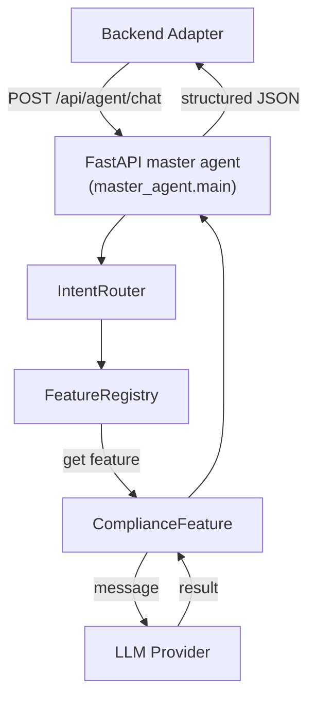

## Setup

### Prerequisites

1. Python 3.10 or newer
2. [Poetry](https://python-poetry.org/) for dependency management

### Install dependencies

```bash
cd agent-service
poetry install
```


```bash
cp .env.example .env
# edit .env so OPENAI_API_KEY has a real value
# optional: set OPENAI_API_BASE if you use a non-default endpoint
```


## Build the FAISS index (required for RAG)

Before starting the API, ingest the PDF knowledge base (AWARD.pdf lives in `agents/shared/assets/`):

```bash
poetry run python scripts/ingest_assets_to_faiss.py
```

This generates the vector store under the path defined by `paths.document_faiss_path` (default: `document_faiss/online/` when using online embeddings, `document_faiss/local/` for local mode). Re-run the script whenever you update the source PDFs or switch modes so each directory stays in sync with its embedding model.

### Security warning

Loading the FAISS store uses `allow_dangerous_deserialization=True`. Only load `.faiss/.pkl` bundles from trusted sources; malicious files can execute arbitrary code during deserialization.

## Run

Start the FastAPI server with Uvicorn via Poetry (after the FAISS index exists).  
`config.yaml` defaults to the OpenAI “online” mode for both embeddings and LLM calls, so ensure `.env` has a valid `OPENAI_API_KEY`. To fall back to a local model, change `model_params.deployment_mode_llm` / `deployment_mode_embedding` back to `local` **and re-run** `scripts/ingest_assets_to_faiss.py` so the FAISS index matches the embedding model in use.

```bash
poetry run uvicorn master_agent.main:app --port 8000
```

The root route (`/`) redirects to Swagger, so opening `http://localhost:8000/` immediately shows the API docs.

## Run Tests

```bash
poetry run pytest
```

## Manual Testing

### 1. Open Swagger UI

Visit:

```
http://localhost:8000/docs
```

### 2. Exercise the master agent endpoint

1. In Swagger, expand **POST /api/agent/chat**.
2. Click **Try it out**.
3. Provide a message and (optionally) upload a file.
4. Execute and verify that the payload is routed to the compliance placeholder feature (the response shows which feature handled the request).

## Directory structure

```
agent-service/
├── .env.example                # Template for API keys
├── config.yaml                 # Central config (LLM modes, FAISS paths, prompts)
├── master_agent/
│   ├── main.py                 # FastAPI entry point
│   ├── intent_router.py
│   ├── feature_registry.py
│   └── config.py               # Helper to load config.yaml
├── scripts/
│   └── ingest_assets_to_faiss.py   # Offline ingestion of assets/AWARD.pdf into FAISS
├── agents/
│   ├── compliance/compliance_feature.py
│   └── shared/
│       ├── file_handler.py
│       ├── rag_retriever.py
│       └── llm/
│           ├── factory.py
│           ├── local_provider.py
│           └── langchain_provider.py
│       ├── vector_db/
│       │   └── faiss_store.py
│       └── assets/
│           └── AWARD.pdf
├── tests/test_master_agent.py
└── README.md
```

## Data flow overview


