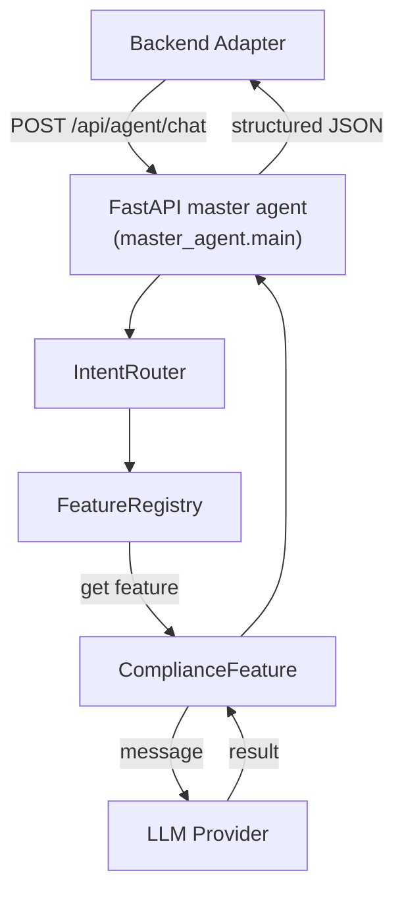

## Setup

### Prerequisites

1. Python 3.10 or newer
2. [Poetry](https://python-poetry.org/) for dependency management

### Install dependencies

```bash
cd agent-service
poetry install
```


```bash
cp .env.example .env
# edit .env so OPENAI_API_KEY has a real value
```


## Run

Start the FastAPI server with Uvicorn via Poetry:

```bash
poetry run uvicorn master_agent.main:app --reload --port 8000
```

The root route (`/`) redirects to Swagger, so opening `http://localhost:8000/` immediately shows the API docs.

## Run Tests

```bash
poetry run pytest
```

## Manual Testing

### 1. Open Swagger UI

Visit:

```
http://localhost:8000/docs
```

### 2. Exercise the master agent endpoint

1. In Swagger, expand **POST /api/agent/chat**.
2. Click **Try it out**.
3. Provide a message and (optionally) upload a file.
4. Execute and verify that the payload is routed to the compliance placeholder feature (the response shows which feature handled the request).

## Directory structure

```
agent-service/
├── .env.example                # Template for API keys
├── config.yaml                 # Central config (LLM modes, FAISS paths, prompts)
├── master_agent/
│   ├── main.py                 # FastAPI entry point
│   ├── intent_router.py
│   ├── feature_registry.py
│   └── config.py               # Helper to load config.yaml
├── agents/
│   ├── compliance/compliance_feature.py
│   └── shared/
│       ├── file_handler.py
│       ├── rag_retriever.py
│       └── llm/
│           ├── factory.py
│           └── langchain_provider.py
├── tests/test_master_agent.py
└── README.md
```

## Data flow overview


