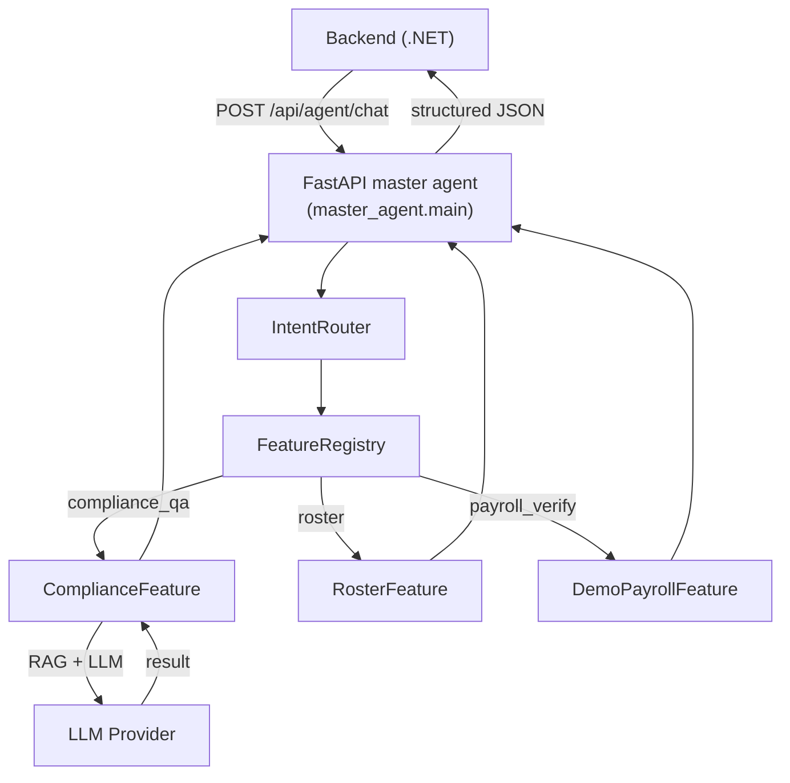

## Setup

### Prerequisites

1. Python 3.11
2. [Poetry](https://python-poetry.org/) for dependency management

### Install dependencies

```bash
cd agent-service
poetry env use 3.11
poetry install
```

If you already created a virtual environment with a different Python version, remove
`.venv` first and then re-run the commands above so local development
matches Docker and CI.

Set secrets via shell environment variables (recommended):

```bash
export OPENAI_API_KEY="your-openai-key"
export AGENT_SERVICE_KEY="your-shared-service-key"
```

Optional: keep non-secret defaults in `.env` by copying `.env.example`.
If you intentionally want dotenv auto-load, set `FAIRWORKLY_ENABLE_DOTENV=1`.


## Build the FAISS index (required for RAG)

Before starting the API, ingest the PDF knowledge base (AWARD.pdf lives in `agents/shared/assets/`):

```bash
poetry run python scripts/ingest_assets_to_faiss.py
```

This generates the vector store under the path defined by `paths.document_faiss_path` (default: `document_faiss/online/` when using online embeddings, `document_faiss/local/` for local mode). Re-run the script whenever you update the source PDFs or switch modes so each directory stays in sync with its embedding model.

### Security warning

Loading the FAISS store uses `allow_dangerous_deserialization=True`. Only load `.faiss/.pkl` bundles from trusted sources; malicious files can execute arbitrary code during deserialization.

## Run

Start the FastAPI server with Uvicorn via Poetry (after the FAISS index exists).  
`config.yaml` defaults to the OpenAI “online” mode for both embeddings and LLM calls, so ensure your shell has a valid `OPENAI_API_KEY`. To fall back to a local model, change `model_params.deployment_mode_llm` / `deployment_mode_embedding` back to `local` **and re-run** `scripts/ingest_assets_to_faiss.py` so the FAISS index matches the embedding model in use.

Security-related env vars:

- `AGENT_SERVICE_KEY` (required): shared secret validated via `X-Service-Key`
- `ALLOWED_ORIGINS` (optional): comma-separated CORS origins, default `http://localhost:5680`
- `MAX_REQUEST_BYTES` (optional): request body size limit for `/api/agent/chat`, default `52428800`
- `RATE_LIMIT_REQUESTS` (optional): request count per window, default `60`
- `RATE_LIMIT_WINDOW_SECONDS` (optional): window size, default `60`

```bash
poetry run uvicorn master_agent.main:app --port 8000
```

The root route (`/`) redirects to Swagger, so opening `http://localhost:8000/` immediately shows the API docs.

## Run Tests

```bash
poetry run pytest
```

## Manual Testing

### 1. Open Swagger UI

Visit:

```
http://localhost:8000/docs
```

### 2. Exercise the master agent endpoint

1. In Swagger, expand **POST /api/agent/chat**.
2. Click **Try it out**.
3. Provide a message and (optionally) upload a file.
4. Add request header `X-Service-Key` with your `AGENT_SERVICE_KEY` value.
5. Execute and verify that the payload is routed to the expected feature.

## Architecture

The agent service is designed as a **multi-agent system** with two layers:

### Master Agent + Domain Agents

```text
agent-service/
├── master_agent/              # Orchestration layer ("master agent")
│   ├── main.py                # FastAPI entry point + /api/agent/chat endpoint
│   ├── intent_router.py       # Intent routing: dispatches to the right feature by hint/file
│   ├── feature_registry.py    # FeatureBase interface + feature registry
│   ├── config.py              # Helper to load config.yaml
│   └── features/              # (legacy location, features now live under agents/)
│
├── agents/                    # Domain agents (business logic implementations)
│   ├── compliance/            # Compliance Q&A (RAG over award documents)
│   ├── payroll/               # Payroll verification
│   └── roster/                # Roster parsing + explanation
│       ├── feature.py         # RosterFeature (file upload → parse)
│       ├── explain_feature.py # RosterExplainFeature (explain parse results)
│       └── services/          # Core parsing logic (excel_reader, row_parsers, etc.)
│
├── shared/                    # Shared utilities (LLM providers, RAG, vector DB)
├── scripts/                   # Offline tooling (FAISS ingestion)
├── tests/                     # Test suite
├── config.yaml                # Central config (LLM modes, FAISS paths, prompts)
└── .env.example               # Template for API keys
```

### Why `main.py` lives under `master_agent/` instead of the project root

- **Semantic clarity**: The master agent is itself a cohesive module with its own responsibilities — request handling, authentication, rate limiting, intent routing, and feature registration. Grouping `main.py`, `intent_router.py`, and `feature_registry.py` together makes it a self-contained package.
- **Parallel structure with `agents/`**: `master_agent/` and `agents/` sit at the same level as peer packages — one handles **dispatch**, the other handles **execution**. If `main.py` were at the root, it would break this symmetry.
- **The startup command reflects the hierarchy**: `uvicorn master_agent.main:app` — you can tell from the command alone that this is the master agent's entry point.

In short: the FastAPI application **is** the master agent, not something that exists outside of all agents. It receives requests, routes them via `IntentRouter`, looks up the target feature in `FeatureRegistry`, and delegates to the appropriate domain agent under `agents/`.

## Data flow overview


```mermaid
flowchart TB
    Client["Backend (.NET)"]
    API["FastAPI master agent\n(master_agent.main)"]
    Router["IntentRouter"]
    Registry["FeatureRegistry"]
    Compliance["ComplianceFeature"]
    Roster["RosterFeature"]
    Payroll["DemoPayrollFeature"]
    LLM["LLM Provider"]

    Client -->|"POST /api/agent/chat"| API --> Router --> Registry
    Registry -->|"compliance_qa"| Compliance -->|"RAG + LLM"| LLM
    Registry -->|"roster"| Roster
    Registry -->|"payroll_verify"| Payroll
    LLM -->|"result"| Compliance --> API -->|"structured JSON"| Client
    Roster --> API
    Payroll --> API
```
