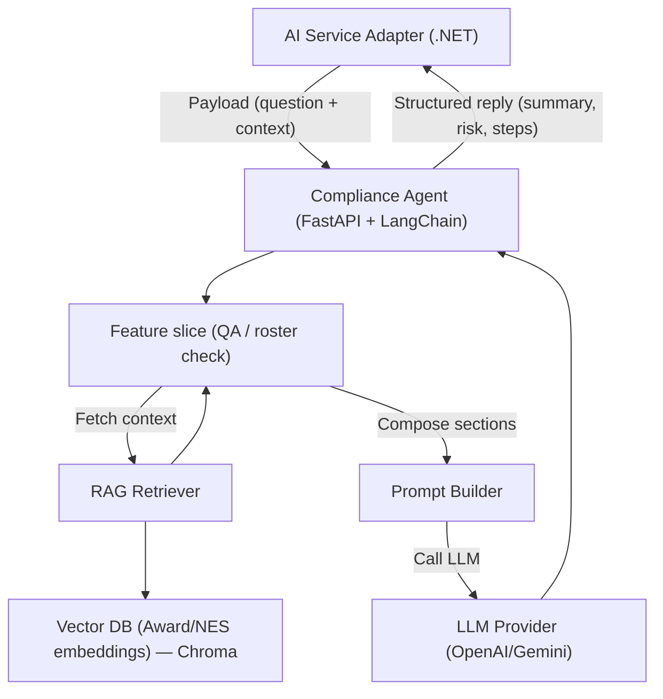

# FairWorkly Agent v0

## Setup

```bash
cd agent-service
python -m venv .venv
source .venv/bin/activate  
# Windows: .venv\Scripts\activate

pip install -r requirements.txt 

```
Create a `.env` file inside `agent-service/` with the following content:
```
OPENAI_API_KEY=your_api_key_here
OPENAI_MODEL=gpt-4o-mini
MODEL_TEMPERATURE=0
```

## Run

```bash
uvicorn main:app --reload --port 8000 --app-dir agent-service
```

## Run Tests

To run the automated tests:

```bash
cd agent-service
pytest
```

Pytest will automatically discover tests inside the `tests/` directory. Make sure your virtual environment is activated before running the tests.


## Manual Testing

### 1. Open Swagger UI

Visit:

```
http://localhost:8000/docs
```


### 2. Test Compliance Q&A

1. In Swagger, expand **POST /agents/compliance/qa**.
2. Click **Try it out**.
3. Use the payload:
   ```json
   {
     "question": "I want a casual to work 10 extra hours, what should I check?"
   }
   ```
4. Execute and review the structured response (summary, obligations, risk level, next steps, links, disclaimer).

## Directory structure

```
agent-service/
├── main.py                         # FastAPI entrypoint, health/docs, router registration
├── llm.py                          # Shared LLM helper (OpenAI client)
├── agents/                         # Each persona-specific agent
│   ├── prompt_builder_base.py      # Shared PromptBuilder base helper
│   ├── compliance/                 # Active agent: Award Q&A, roster checks
│   │   ├── router.py               # Mounts Compliance feature routes
│   │   ├── prompt_builder.py       # Compliance-specific prompt rules
│   │   └── features/
│   │       └── ask_ai_question/    # Q&A Copilot
│   │           ├── handler.py      # Orchestrates the feature logic
│   │           └── schemas.py      # Request/response DTOs
│   ├── documents/                  # (To add) Document & Contract
│   │   ├── router.py
│   │   ├── prompt_builder.py
│   │   └── features/
│   ├── payroll/                    # (To add) Payroll & STP Check
│   │   ├── router.py
│   │   ├── prompt_builder.py
│   │   └── features/
│   └── employee_help/              # (To add) Employee self-service agent
│       ├── router.py
│       ├── prompt_builder.py
│       └── features/
└── tests/
    ├── test_health.py              # Global health endpoint smoke test
    └── compliance/
        └── test_qa.py              # Compliance Q&A endpoint tests
```

## Data flow overview (Compliance Agent)


