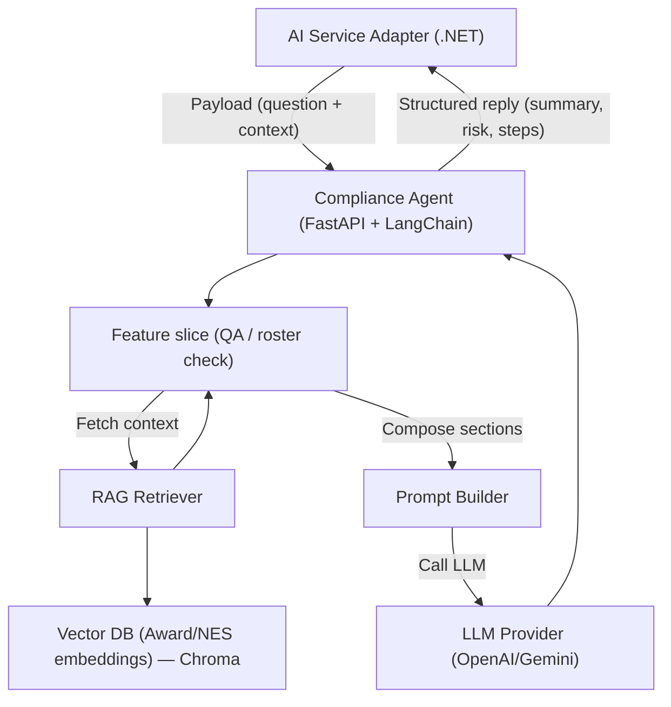

# FairWorkly Agent v0

## Setup

Prerequisites (one-time):

1. Install Python 3.10+
2. Install the `uv` CLI (`pip install uv`).

Run the following commands inside the `agent-service/` directory:

```bash
uv sync
```

Create a `.env` file (or copy `.env.example`) with the following content:
```
OPENAI_API_KEY=your_api_key_here
OPENAI_MODEL=gpt-4o-mini
MODEL_TEMPERATURE=0
```

## Run

```bash
uv run uvicorn main:app --reload --port 8000 --app-dir agent-service
```

## Run Tests

To run the automated tests:

```bash
uv run pytest
```

Pytest will automatically discover tests inside the `tests/` directory. Make sure your virtual environment is activated before running the tests.


## Manual Testing

### 1. Open Swagger UI

Visit:

```
http://localhost:8000/docs
```


### 2. Test Compliance Q&A

1. In Swagger, expand **POST /agents/compliance/qa**.
2. Click **Try it out**.
3. Use the payload:
   ```json
   {
     "question": "I want a casual to work 10 extra hours, what should I check?"
   }
   ```
4. Execute and review the structured response (summary, obligations, risk level, next steps, links, disclaimer).

## Directory structure

```
agent-service/
├── .env.example                    # Template for environment variables
├── main.py                         # FastAPI entrypoint
├── llm.py                          # Shared LLM helper
├── agents/                         # Specific agent
│   ├── compliance/                 # Award Q&A, roster checks
│   │   ├── router.py               # Routes
│   │   ├── prompt_builder.py       # Prompt rules
│   │   └── features/               # Agent skills
│   │       └── ask_ai_question/    # Q&A Copilot
│   │           ├── handler.py      # Feature logic
│   │           └── schemas.py      # Request/response DTOs
│   ├── documents/                  # (To add) Document & Contract
│   ├── payroll/                    # (To add) Payroll & STP Check
│   └── employee_help/              # (To add) Employee self-service agent
└── tests/
    ├── test_health.py              # Health endpoint smoke test
    └── agents/
        └── compliance/
            └── test_qa.py          # Compliance Q&A endpoint tests
```

## Data flow overview (Compliance Agent)


