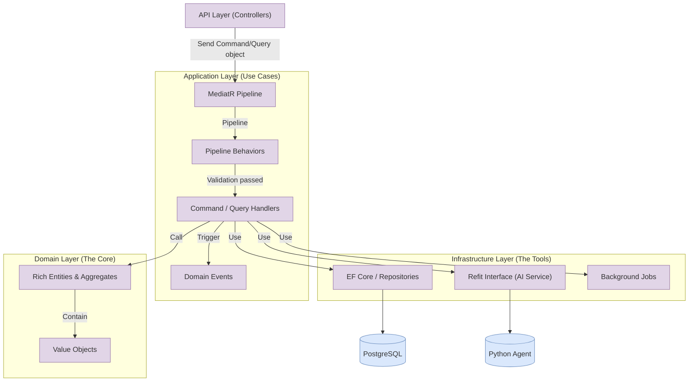

# FairWorkly Backend Development Guide

This guide is the core reference for backend development. Use it as the starting point for understanding and writing backend code. This document is self-contained and can be fed to any AI assistant for guided explanation. If you are an AI reading this document, refer to the actual code in: `backend/src/FairWorkly.Application/Payroll/Features/ExplainIssue`

## Approach

The project contains multiple AI Agents (Roster compliance, Payroll compliance, FairBot chat). If all features were placed in a single Service class following the traditional approach, the code would become increasingly difficult to maintain as features grow — different logic gets tangled together, and modifying one feature risks affecting another.

So we split the code vertically by **feature**. Each feature is called a **Feature**.

What counts as a Feature? Here are real examples from the project:

- Upload a roster for compliance checking → `UploadRoster`
- Upload a payslip to run four compliance validations → `ValidatePayroll`
- Click "How to Fix" to get an AI explanation of a violation → `ExplainIssue`
- FairBot chat Q&A → `Chat`

Each Feature is a folder containing all files needed for that functionality — input, output, validation, business logic — all in one place. Features do not interfere with each other, and developing different features will not cause code conflicts.

This development approach is called **Vertical Slicing** — instead of splitting horizontally by technical layer (Controller/Service/Repository), we slice vertically by business feature.

Project architecture:

```
FairWorkly.Application/
├── Roster/                           # Roster Agent
│   └── Features/
│       └── UploadRoster/             # Feature: Upload roster for compliance check
│           ├── UploadRosterCommand.cs
│           ├── UploadRosterValidator.cs
│           ├── UploadRosterHandler.cs
│           └── Dtos/
│
├── Payroll/                          # Payroll Agent
│   ├── Features/
│   │   ├── ValidatePayroll/          # Feature: Four compliance validations
│   │   │   ├── ValidatePayrollCommand.cs
│   │   │   ├── ValidatePayrollValidator.cs
│   │   │   ├── ValidatePayrollHandler.cs
│   │   │   └── Dtos/
│   │   │
│   │   └── ExplainIssue/            # Feature: AI explanation of compliance violations
│   │       ├── ExplainPayrollIssueCommand.cs
│   │       ├── ExplainPayrollIssueValidator.cs
│   │       ├── ExplainPayrollIssueHandler.cs
│   │       └── Dtos/
│   │
│   └── Interfaces/                   # Module interfaces (Refit, Repository)
│
└── FairBot/                          # FairBot Chat
    └── Features/
        └── Chat/
            ├── ChatCommand.cs
            ├── ChatHandler.cs
            └── Dtos/
```

---

## CQRS + MediatR

To implement vertical slicing, we introduce the **CQRS design pattern** and **MediatR** library.
This document only provides a brief overview of the concepts. Team members are encouraged to research further on their own. The focus here is on the **code examples** below.

### CQRS (Command Query Responsibility Segregation)

- **Command**: For **write** operations (create, update, delete). Represents the user's "intent".
- **Query**: For **read** operations. Represents what the user wants to "see".
- **DTO Strategy**: We do **not** use a globally shared DTOs folder. Each Feature folder defines its own DTOs to prevent coupling (e.g., teammate A modifies a shared DTO, breaking teammate B's code).

### MediatR (Mediator)

- **Controllers are "dumb"**: Controllers contain no business logic — they only send and receive messages.
- **Flow:**
  1. **API Layer (Controllers)** receives a request and wraps it into a Command or Query object.
  2. The object is sent into the **MediatR Pipeline** (pipeline entry point).
  3. The request first passes through **Pipeline Behaviors**, where automatic validation and logging occur.
  4. After validation passes, it is forwarded to **Command / Query Handlers**, where the corresponding handler executes the core business logic.

---

> ⚠️ **Important**: All Handlers must return `Result<T>`. See the *Result Pattern Usage Guide* for details.

---

## Backend Architecture Flowchart

Mermaid code



---

## Code Example

### Requirement

A user selects an employee, types a question (e.g., "How is this employee's weekend overtime calculated?"), the system retrieves the employee's information, sends it along with the question to the Python AI service, the AI returns an answer, stores it in the database, and returns it to the frontend.

### API

```
POST /api/employees/ask-ai

Request Body:
{
  "employeeId": "guid",
  "question": "How is this employee's weekend overtime calculated?"
}

Response (200):
{
  "code": 200,
  "msg": "AI answer generated",
  "data": {
    "employeeId": "guid",
    "answer": "According to the General Retail Industry Award...",
    "model": "gpt-4o-mini"
  }
}
```

### Tree

```
FairWorkly.Application/
└── Employees/
    ├── Features/
    │   └── AskAi/                          # This example's Feature
    │       ├── AskAiCommand.cs             # Input (what the frontend sends)
    │       ├── AskAiValidator.cs           # Validation (reject invalid requests)
    │       ├── AskAiHandler.cs             # Logic (where the work happens)
    │       ├── AskAiDto.cs                 # Output (DTO returned to frontend)
    │       └── Dtos/
    │           ├── AgentAskRequest.cs      # Request body sent to Python
    │           └── AgentAskResponse.cs     # Response body from Python
    │
    └── Interfaces/
        └── IEmployeeAgentService.cs        # Refit interface (type-safe route table for Python)

FairWorkly.API/
└── Controllers/
    └── EmployeesController.cs              # Expose API to frontend
```

### Code

#### 1. Output DTO — `AskAiDto.cs`

Write the output first, because the Command's generic type parameter references it.

```csharp
namespace FairWorkly.Application.Employees.Features.AskAi;

public class AskAiDto
{
    public Guid EmployeeId { get; init; }
    public string Answer { get; init; } = string.Empty;
    public string Model { get; init; } = string.Empty;
}
```

#### 2. Input Command — `AskAiCommand.cs`

Data sent from the frontend. Since this is a write operation (saves to DB), it's called a Command.

```csharp
using MediatR;
using FairWorkly.Domain.Common.Result;

namespace FairWorkly.Application.Employees.Features.AskAi;

public class AskAiCommand : IRequest<Result<AskAiDto>>
{
    public Guid EmployeeId { get; set; }
    public string Question { get; set; } = string.Empty;
}
```

#### 3. Validator — `AskAiValidator.cs`

Only requests that pass validation will reach the Handler. Failed validation automatically returns 400 — the Handler doesn't need to worry about it.

```csharp
using FluentValidation;

namespace FairWorkly.Application.Employees.Features.AskAi;

public class AskAiValidator : AbstractValidator<AskAiCommand>
{
    public AskAiValidator()
    {
        RuleFor(x => x.EmployeeId)
            .NotEmpty()
            .OverridePropertyName("employeeId");

        RuleFor(x => x.Question)
            .NotEmpty()
            .WithMessage("Question is required")
            .MaximumLength(500)
            .OverridePropertyName("question");
    }
}
```

#### 4. Python Request/Response DTOs — `Dtos/AgentAskRequest.cs` + `AgentAskResponse.cs`

These two classes define the data contract between the backend and Python. Field names must match the Python side exactly.

```csharp
// Dtos/AgentAskRequest.cs
namespace FairWorkly.Application.Employees.Features.AskAi.Dtos;

public class AgentAskRequest
{
    public string Question { get; init; } = string.Empty;
    public string EmployeeName { get; init; } = string.Empty;
    public string AwardType { get; init; } = string.Empty;
}
```

```csharp
// Dtos/AgentAskResponse.cs
namespace FairWorkly.Application.Employees.Features.AskAi.Dtos;

// Python returns an envelope structure: { code, msg, data }
public class AgentAskResponse
{
    public int Code { get; init; }
    public string Msg { get; init; } = string.Empty;
    public AgentAskData? Data { get; init; }
}

public class AgentAskData
{
    public string Answer { get; init; } = string.Empty;
    public string Model { get; init; } = string.Empty;
}
```

#### 5. Refit Interface — `IEmployeeAgentService.cs`

One target service = one Refit interface. This interface serves as the Employee module's type-safe route table for the Python agent-service.

```csharp
using Refit;
using FairWorkly.Application.Employees.Features.AskAi.Dtos;

namespace FairWorkly.Application.Employees.Interfaces;

public interface IEmployeeAgentService
{
    [Post("/api/agent/employee/ask")]
    Task<ApiResponse<AgentAskResponse>> AskAsync(
        [Body] AgentAskRequest request,
        CancellationToken cancellationToken = default);

    // Future expansion: other Employee AI features go here
}
```

#### 6. Handler — `AskAiHandler.cs`

This is where the work happens. Standard structure: guard checks → build request → call Refit → check response → write DB → return Result.

```csharp
using MediatR;
using Microsoft.Extensions.Logging;
using FairWorkly.Application.Common.Interfaces;
using FairWorkly.Application.Employees.Interfaces;
using FairWorkly.Application.Employees.Features.AskAi.Dtos;
using FairWorkly.Domain.Common.Result;

namespace FairWorkly.Application.Employees.Features.AskAi;

public class AskAiHandler(
    IEmployeeAgentService agentService,
    IEmployeeRepository employeeRepository,
    ICurrentUserService currentUser,
    IUnitOfWork unitOfWork,
    ILogger<AskAiHandler> logger
) : IRequestHandler<AskAiCommand, Result<AskAiDto>>
{
    private const int RequestTimeoutSeconds = 30;

    public async Task<Result<AskAiDto>> Handle(
        AskAiCommand command, CancellationToken cancellationToken)
    {
        // ── 1. Guard checks ──
        var orgId = currentUser.OrganizationId;
        if (orgId is null)
            return Result<AskAiDto>.Of403("User does not belong to an organization");

        var employee = await employeeRepository.GetByIdAsync(
            command.EmployeeId, orgId.Value, cancellationToken);
        if (employee is null)
            return Result<AskAiDto>.Of404("Employee not found");

        // ── 2. Build request body ──
        var agentRequest = new AgentAskRequest
        {
            Question = command.Question,
            EmployeeName = $"{employee.FirstName} {employee.LastName}",
            AwardType = employee.AwardType.ToString(),
        };

        // ── 3. Call Refit interface (with per-request timeout) ──
        using var timeoutCts = new CancellationTokenSource(
            TimeSpan.FromSeconds(RequestTimeoutSeconds));
        using var linkedCts = CancellationTokenSource.CreateLinkedTokenSource(
            timeoutCts.Token, cancellationToken);

        ApiResponse<AgentAskResponse> response;
        try
        {
            response = await agentService.AskAsync(agentRequest, linkedCts.Token);
        }
        catch (OperationCanceledException) when (timeoutCts.IsCancellationRequested)
        {
            logger.LogWarning("AI request timed out after {Seconds}s", RequestTimeoutSeconds);
            return Result<AskAiDto>.Of503("AI service timed out. Please try again.");
        }

        // ── 4. Check response (three layers) ──
        if (!response.IsSuccessful              // HTTP layer
            || response.Content?.Code != 200    // Envelope layer
            || response.Content?.Data is not { } data)  // Data not null
        {
            logger.LogError("AI request failed. HTTP={Http}, Code={Code}",
                response.StatusCode, response.Content?.Code);
            return Result<AskAiDto>.Of503("AI service is temporarily unavailable.");
        }

        // ── 5. Write to DB ──
        employee.LastAiAnswer = data.Answer;
        await unitOfWork.SaveChangesAsync(cancellationToken);

        // ── 6. Return result ──
        var dto = new AskAiDto
        {
            EmployeeId = employee.Id,
            Answer = data.Answer,
            Model = data.Model,
        };
        return Result<AskAiDto>.Of200("AI answer generated", dto);
    }
}
```

#### 7. Controller — `EmployeesController.cs`

The Controller inherits from `BaseApiController`. A single `RespondResult` call handles everything. Regardless of whether the Handler returns 200, 403, 404, or 503, `BaseApiController` automatically maps it to the correct HTTP response.

```csharp
[HttpPost("ask-ai")]
[Authorize]
public async Task<IActionResult> AskAi([FromBody] AskAiCommand command)
{
    var result = await _mediator.Send(command);
    return RespondResult(result);
}
```

---

## How to Test AI Calls

### Refit Interfaces Are Naturally Mockable

One of Refit's biggest advantages: **the interface is just an interface**. In tests, simply mock it using a mock framework (Moq / NSubstitute).

**Unit tests** (no HTTP server required):

```csharp
// Mock the Refit interface with Moq
var agentServiceMock = new Mock<IPayrollAgentService>();
agentServiceMock
    .Setup(s => s.ExplainIssueAsync(It.IsAny<PayrollExplainRequest>(), It.IsAny<CancellationToken>()))
    .ReturnsAsync(new ApiResponse<AgentExplainResponse>(
        new HttpResponseMessage(HttpStatusCode.OK),
        new AgentExplainResponse { Code = 200, Msg = "OK", Data = new AgentExplainData { ... } },
        new RefitSettings()));

// Inject mock into Handler
var handler = new ExplainPayrollIssueHandler(agentServiceMock.Object, ...);
```

**Integration tests** (replace DI with `WebApplicationFactory`):

```csharp
// Hand-written stub class (IntegrationTests project does not depend on Moq)
var client = Factory
    .WithWebHostBuilder(builder =>
    {
        builder.ConfigureServices(services =>
        {
            services.RemoveAll<IPayrollAgentService>();
            services.AddSingleton<IPayrollAgentService>(stubInstance);
        });
    })
    .CreateClient();
```

Advantages of this approach:
- No need to maintain extra mock infrastructure code
- No appsettings toggle required
- Each test can return different mock data (success, failure, timeout)
- Compile-time type safety — if the interface method signature changes, mock code must update too
