# FairWorkly Database ER Diagram

This diagram shows the entity-relationship model for the FairWorkly database.

## Entity Relationship Diagram

```mermaid
erDiagram
    %% Core Entities
    ORGANIZATION ||--o{ USER : "has"
    ORGANIZATION ||--o{ EMPLOYEE : "employs"
    ORGANIZATION ||--o{ ORGANIZATION_AWARD : "uses"
    ORGANIZATION ||--o{ ROSTER : "creates"
    ORGANIZATION ||--o{ PAYROLL_VALIDATION : "runs"
    ORGANIZATION ||--o{ DOCUMENT : "manages"

    %% User & Employee
    USER }o--|| ORGANIZATION : "belongs to"
    USER }o--o| EMPLOYEE : "linked to"

    EMPLOYEE }o--|| ORGANIZATION : "works for"
    EMPLOYEE ||--o{ SHIFT : "works"
    EMPLOYEE ||--o{ PAYSLIP : "receives"
    EMPLOYEE ||--o{ DOCUMENT : "has"

    %% Awards
    AWARD ||--o{ AWARD_LEVEL : "has levels"

    %% Roster Domain
    ROSTER }o--|| ORGANIZATION : "belongs to"
    ROSTER ||--o{ SHIFT : "contains"
    ROSTER ||--o| ROSTER_VALIDATION : "validated by"

    SHIFT }o--|| ROSTER : "part of"
    SHIFT }o--|| EMPLOYEE : "assigned to"
    SHIFT }o--|| ORGANIZATION : "belongs to"
    SHIFT ||--o{ ROSTER_ISSUE : "may have"

    ROSTER_VALIDATION }o--|| ORGANIZATION : "belongs to"
    ROSTER_VALIDATION }o--|| ROSTER : "validates"
    ROSTER_VALIDATION ||--o{ ROSTER_ISSUE : "identifies"

    ROSTER_ISSUE }o--|| ROSTER_VALIDATION : "belongs to"
    ROSTER_ISSUE }o--|| EMPLOYEE : "affects"
    ROSTER_ISSUE }o--o| SHIFT : "relates to"
    ROSTER_ISSUE }o--|| ORGANIZATION : "belongs to"
    ROSTER_ISSUE }o--o| USER : "resolved by"

    %% Payroll Domain
    PAYSLIP }o--|| ORGANIZATION : "belongs to"
    PAYSLIP }o--|| EMPLOYEE : "for"
    PAYSLIP }o--o| PAYROLL_VALIDATION : "validated by"
    PAYSLIP ||--o{ PAYROLL_ISSUE : "may have"

    PAYROLL_VALIDATION }o--|| ORGANIZATION : "belongs to"
    PAYROLL_VALIDATION ||--o{ PAYSLIP : "validates"
    PAYROLL_VALIDATION ||--o{ PAYROLL_ISSUE : "identifies"

    PAYROLL_ISSUE }o--|| PAYROLL_VALIDATION : "belongs to"
    PAYROLL_ISSUE }o--|| PAYSLIP : "relates to"
    PAYROLL_ISSUE }o--|| EMPLOYEE : "affects"
    PAYROLL_ISSUE }o--|| ORGANIZATION : "belongs to"
    PAYROLL_ISSUE }o--o| USER : "resolved by"

    %% Documents
    DOCUMENT }o--|| ORGANIZATION : "belongs to"
    DOCUMENT }o--o| EMPLOYEE : "for"

    %% Entity Details
    ORGANIZATION {
        uuid id PK
        string company_name
        string abn
        string industry_type
        enum subscription_tier
        boolean is_subscription_active
        int max_employees
        timestamp created_at
        boolean is_deleted
    }

    USER {
        uuid id PK
        uuid organization_id FK
        uuid employee_id FK "nullable"
        string email
        string first_name
        string last_name
        enum role
        boolean is_active
        string password_hash
        timestamp created_at
    }

    EMPLOYEE {
        uuid id PK
        uuid organization_id FK
        string first_name
        string last_name
        string email "nullable"
        enum employment_type
        enum award_type
        int award_level_number
        date start_date
        date end_date "nullable"
        boolean is_active
        boolean is_student
        decimal guaranteed_hours "nullable"
        timestamp created_at
        boolean is_deleted
    }

    ORGANIZATION_AWARD {
        uuid id PK
        uuid organization_id FK
        enum award_type
        boolean is_primary
        int employee_count
        timestamp added_at
        boolean is_deleted
    }

    AWARD {
        uuid id PK
        enum award_type
        string name
        string award_code
        decimal saturday_penalty_rate
        decimal sunday_penalty_rate
        decimal public_holiday_penalty_rate
        decimal casual_loading_rate
        decimal minimum_shift_hours
        int max_consecutive_days
        timestamp created_at
        boolean is_deleted
    }

    AWARD_LEVEL {
        uuid id PK
        uuid award_id FK
        int level_number
        string level_name
        decimal full_time_hourly_rate
        decimal part_time_hourly_rate
        decimal casual_hourly_rate
        timestamp effective_from
        timestamp effective_to "nullable"
        boolean is_active
        timestamp created_at
        boolean is_deleted
    }

    ROSTER {
        uuid id PK
        uuid organization_id FK
        date week_start_date
        date week_end_date
        int week_number
        int year
        boolean is_finalized
        int total_shifts
        decimal total_hours
        int total_employees
        timestamp created_at
        boolean is_deleted
    }

    SHIFT {
        uuid id PK
        uuid organization_id FK
        uuid roster_id FK
        uuid employee_id FK
        date date
        time start_time
        time end_time
        decimal duration
        boolean has_meal_break
        int meal_break_duration "nullable"
        boolean is_public_holiday
        string public_holiday_name "nullable"
        timestamp created_at
        boolean is_deleted
    }

    ROSTER_VALIDATION {
        uuid id PK
        uuid organization_id FK
        uuid roster_id FK
        enum status
        date week_start_date
        date week_end_date
        int total_shifts
        int passed_shifts
        int failed_shifts
        int total_issues_count
        int critical_issues_count
        string executed_check_types
        timestamp started_at
        timestamp completed_at "nullable"
        timestamp created_at
        boolean is_deleted
    }

    ROSTER_ISSUE {
        uuid id PK
        uuid organization_id FK
        uuid roster_validation_id FK
        uuid shift_id FK "nullable"
        uuid employee_id FK
        enum check_type
        enum severity
        string description
        string detailed_explanation
        decimal expected_value "nullable"
        decimal actual_value "nullable"
        boolean is_resolved
        uuid resolved_by_user_id FK "nullable"
        timestamp created_at
        boolean is_deleted
    }

    PAYSLIP {
        uuid id PK
        uuid organization_id FK
        uuid employee_id FK
        uuid payroll_validation_id FK "nullable"
        date pay_period_start
        date pay_period_end
        date pay_date
        string employee_name
        enum employment_type
        decimal hourly_rate
        decimal ordinary_hours
        decimal gross_pay
        decimal tax
        decimal superannuation
        decimal net_pay
        timestamp created_at
        boolean is_deleted
    }

    PAYROLL_VALIDATION {
        uuid id PK
        uuid organization_id FK
        enum status
        date pay_period_start
        date pay_period_end
        string file_path
        int total_payslips
        int passed_count
        int failed_count
        int total_issues_count
        boolean base_rate_check_performed
        boolean penalty_rate_check_performed
        timestamp started_at
        timestamp completed_at "nullable"
        timestamp created_at
        boolean is_deleted
    }

    PAYROLL_ISSUE {
        uuid id PK
        uuid organization_id FK
        uuid payroll_validation_id FK
        uuid payslip_id FK
        uuid employee_id FK
        enum category_type
        enum severity
        string warning_message "nullable"
        decimal expected_value "nullable"
        decimal actual_value "nullable"
        boolean is_resolved
        uuid resolved_by_user_id FK "nullable"
        timestamp created_at
        boolean is_deleted
    }

    DOCUMENT {
        uuid id PK
        uuid organization_id FK
        uuid employee_id FK "nullable"
        enum document_type
        boolean is_provided
        timestamp provided_at "nullable"
        boolean is_legally_required
        date compliance_deadline "nullable"
        string uploaded_file_name "nullable"
        timestamp created_at
        boolean is_deleted
    }
```

## Key Design Patterns

### Multi-Tenancy
All entities include `organization_id` foreign key to ensure data isolation per organization.

### Soft Delete
All entities inherit `is_deleted` boolean from `BaseEntity` for soft-delete support.

### Audit Trail
Most entities inherit from `AuditableEntity` which tracks:
- `created_by_user_id` / `updated_by_user_id`
- `created_at` / `updated_at`

### Validation Architecture
Two parallel validation domains:

1. **Roster Validation**
   - `Roster` → `RosterValidation` → `RosterIssue`
   - Validates shifts against Award compliance rules

2. **Payroll Validation**
   - `PayrollValidation` → `Payslip` → `PayrollIssue`
   - Validates payslips against Award rates and entitlements

### Issue Resolution
Both `RosterIssue` and `PayrollIssue` support:
- Resolution tracking (`is_resolved`, `resolved_by_user_id`)
- Severity levels (Info/Warning/Error/Critical)
- Evidence tracking (expected vs actual values)

## Entity Groups

### Core Tenant Management
- Organization
- User
- OrganizationAward

### Employee Management
- Employee
- Document

### Award System
- Award
- AwardLevel

### Roster Domain
- Roster
- Shift
- RosterValidation
- RosterIssue

### Payroll Domain
- Payslip
- PayrollValidation
- PayrollIssue

## Notes

- All timestamps use PostgreSQL `timestamp with time zone`
- All IDs are UUIDs (v4)
- Snake_case naming convention for all database columns
- Enum types are stored as integers in the database
