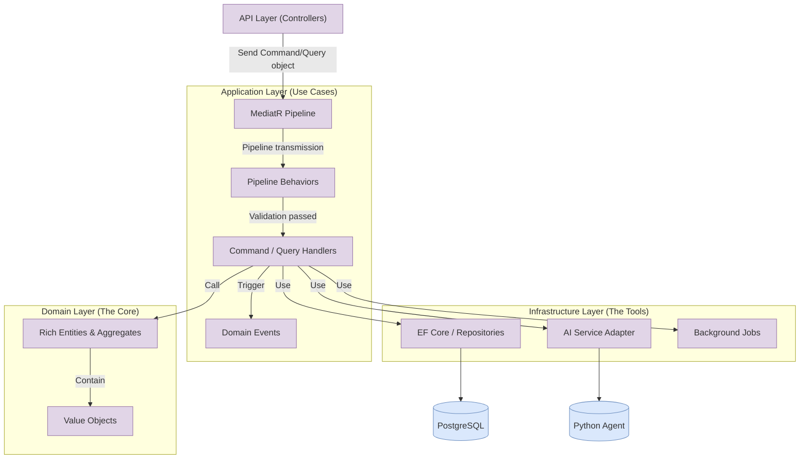
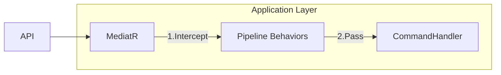

# FairWorkly Backend Development Guide

This guide is the core reference for backend development. Use it as a starting point to understand and build the backend. This document can be fed to any AI assistant for explanation—the context should be complete.

## Overview

This project can be abstractly thought of as developing 4 AI agents, each with different skills and workflows. The "skills" are handled by the AI team (Prompt Engineering), while the backend is responsible for developing the "workflows" and "toolbox" the AI needs. The tools used by the AI follow traditional development patterns—for example, if the AI needs an employee's hire date to determine probation period, the backend writes classic database query logic to fetch and feed the data to the AI. Therefore, this document does not cover these basic implementations. This document focuses on how the Application layer encapsulates and orchestrates these AI workflows through architectural design.

We can think of a "Workflow (Feature)" as the complete thought process of an AI HR handling a specific business task. For example, when a user asks: "Is my shift for Xiao Wang this week legal?" The AI HR won't answer off the top of its head. First, it executes a **"check records"** action (backend Tool), querying the database for Xiao Wang's employment type (Casual/Full-time) and historical work hours. Then, it executes a **"check regulations"** action (RAG), locating applicable Award clauses in the knowledge base. Finally, it feeds this "factual data" to the large model for **"compliance reasoning"** and returns the final risk report to the user. This entire automated loop—triggered by user intent, connecting "database query, retrieval, reasoning, output"—is encapsulated as an independent **Feature (functional slice)** in our project structure.

To develop according to business logic, we first need to vertically slice the entire project into 4 AI Agents developed separately, with each Agent's Features developed independently. Each team member's task is to develop individual Features. This approach promotes code decoupling between team members, and since it aligns with business logic, communication becomes clearer.

This development approach is called **Vertical Slicing**

The project architecture is shown below (Features are examples, not actual business logic):

```
FairWorkly-Backend-Solution/
├── src/
│   ├── FairWorkly.API/
│   │   └── Controllers/              # Same as traditional structure
│   │       ├── RosterController.cs
│   │       ├── DocumentsController.cs
│   │       ├── PayrollController.cs
│   │       └── EmployeesController.cs
│   │
│   ├── FairWorkly.Application/       # ✅ Application Layer (Key change: split by Agent)
│   │   ├── Roster/               # [Agent A] Roster Compliance
│   │   │   └── Features/             # Vertical slices
│   │   │       └── UploadRoster/     # Feature: Upload Roster
│   │   │           ├── UploadRosterCommand.cs
│   │   │           └── UploadRosterHandler.cs
│   │   │
│   │   ├── Documents/                # [Agent B] Documents
│   │   │   └── Features/
│   │   │       └── GenerateContract/ # Feature: Generate Contract
│   │   │           ├── GenerateContractCommand.cs
│   │   │           └── GenerateContractHandler.cs
│   │   │
│   │   ├── Payroll/                  # [Agent C] Payroll
│   │   │   └── Features/
│   │   │       └── RunPayrollCheck/  # Feature: Run Payroll Check
│   │   │           ├── RunPayrollCheckCommand.cs
│   │   │           └── RunPayrollCheckHandler.cs
│   │   │
│   │   └── Employees/                # [Agent D] Employees
│   │       └── Features/
│   │           └── CreateEmployee/   # Feature: Create Employee
│   │               ├── CreateEmployeeCommand.cs
│   │               └── CreateEmployeeHandler.cs
│   │
│   └── FairWorkly.Infrastructure/    # Same as traditional structure
│       └── Repositories/
│           └── ...
```

---

## CQRS + MediatR

To implement vertical slicing, we need to introduce the **CQRS design pattern** and **MediatR technology**.
This document only briefly covers the conceptual understanding—team members can do deeper research on their own. This document focuses on the **code examples** below.

### CQRS (Command Query Responsibility Segregation)

  * **Command**: For **write** operations (create, update, delete). Represents user "intent".
  * **Query**: For **read** operations. Represents what the user wants to "see".
  * **DTO Strategy**: We **do not use** a globally shared DTOs folder. Each Feature folder defines its own dedicated DTO to prevent logic coupling (i.e., multiple people using one DTO, then teammate A changes the DTO one day, and teammate B's code breaks).

### MediatR (Mediator)

  * **Controller is "dumb"**: Controller contains no business logic—it only sends and receives messages.
* **Flow:**
  1. **API Layer (Controllers)** receives a request and wraps it into a Command or Query object.
  2. Sends the object into the **MediatR Pipeline** (pipeline entry).
  3. The request first passes through the **Pipeline Behaviors** layer for automatic validation or logging.
  4. After validation passes, it's transmitted to the **Command / Query Handlers** layer, where the corresponding handler executes core business logic.

---

> ⚠️ **Important**: All Handlers must return `Result<T>`. See [Result<T> Pattern Guide](./Result_Pattern_Guide.md)

---

## Backend Architecture Flowchart

Mermaid code:



---

## Code Examples

Understanding CQRS + MediatR through practical business scenarios, from simple to complex.

### Lab 1: Developing a Simple Query

**Business Scenario**: We need to implement **"Get Employee Details by ID"** in the `Employee` module.

The overall file structure for this feature:
```
FairWorkly.Application/
└── Employees/                      <-- Module folder
    └── Features/                   <-- Vertical slicing root
        └── GetEmployeeDetail/      <-- [New] This lab's Feature folder
            ├── GetEmployeeDetailQuery.cs    # Input: ID from frontend
            ├── EmployeeDetailDto.cs         # Output: Data returned to frontend
            └── GetEmployeeDetailHandler.cs  # Logic: Query DB, transform
```

#### Step 1: Create the Folder

Name this feature **`GetEmployeeDetail`**
Create under the Features folder

```
FairWorkly.Application/
└── Employees/                      <-- Module folder
    └── Features/                   <-- Vertical slicing root
        └── GetEmployeeDetail/      <-- [New] This lab's Feature folder
```

---

#### Step 2: Define the "Output" (The Output DTO)

Write the "output" first, because the "input" code has a generic that needs the "output" class.

This data is sent to the frontend—don't expose sensitive information like user passwords.

1.  In the `GetEmployeeDetail` folder, create **`EmployeeDetailDto.cs`**.

```csharp
namespace FairWorkly.Application.Employees.Features.GetEmployeeDetail;

// Properties here should be based on frontend page requirements
// e.g., the detail page needs to display: name, email, hire date, status
public class EmployeeDetailDto
{
    public Guid Id { get; set; }
    public string FirstName { get; set; } = string.Empty;
    public string LastName { get; set; } = string.Empty;
    public string Email { get; set; } = string.Empty;
    public string EmploymentType { get; set; } = string.Empty;
    public string Status { get; set; } = string.Empty;
}
```

-----

#### Step 3: Define the "Input" (The Input Query)

This is the request from the frontend. Since it's a "read operation", we call it a `Query`.

1.  In the `GetEmployeeDetail` folder, create **`GetEmployeeDetailQuery.cs`**.

```csharp
using MediatR;
using FairWorkly.Domain.Common;

namespace FairWorkly.Application.Employees.Features.GetEmployeeDetail;

// 1. The T in IRequest<T> must be wrapped with Result<DTO>
//    Meaning: sending this request returns a Result<EmployeeDetailDto>
public class GetEmployeeDetailQuery : IRequest<Result<EmployeeDetailDto>>
{
    // Frontend only needs to pass an ID
    public Guid EmployeeId { get; set; }
}
```

-----

#### Step 4: Write the "Logic" (The Handler)

This is where the work happens. It receives the `Query` (input), queries the database, and returns the `Dto` (output).

1.  In the `GetEmployeeDetail` folder, create **`GetEmployeeDetailHandler.cs`**.

```csharp
using MediatR;
using FairWorkly.Application.Employees.Interfaces;
using FairWorkly.Domain.Common;

namespace FairWorkly.Application.Employees.Features.GetEmployeeDetail;

public class GetEmployeeDetailHandler : IRequestHandler<GetEmployeeDetailQuery, Result<EmployeeDetailDto>>
{
    private readonly IEmployeeRepository _repository;

    public GetEmployeeDetailHandler(IEmployeeRepository repository)
    {
        _repository = repository;
    }

    // Core logic: Handle method
    public async Task<Result<EmployeeDetailDto>> Handle(GetEmployeeDetailQuery request, CancellationToken cancellationToken)
    {
        // 1. Query database
        var employee = await _repository.GetByIdAsync(request.EmployeeId, cancellationToken);

        // 2. If not found, return NotFound
        if (employee == null)
        {
            return Result<EmployeeDetailDto>.NotFound($"Employee {request.EmployeeId} not found");
        }

        // 3. Manually map Entity -> DTO, wrap with Success
        var dto = new EmployeeDetailDto
        {
            Id = employee.Id,
            FirstName = employee.FirstName,
            LastName = employee.LastName,
            Email = employee.Email,
            EmploymentType = employee.EmploymentType,
            Status = employee.Status
        };

        return Result<EmployeeDetailDto>.Success(dto);
    }
}
```

-----

#### Step 5: Expose the API (The Controller)

Backend logic is done. Finally, open an endpoint in the API layer for the frontend to call.

1.  Go to the **`FairWorkly.API`** project's **`Controllers`** folder.
2.  If it doesn't exist, create **`EmployeesController.cs`** (or open it if it exists).
3.  Add the `Get` method:

```csharp
using MediatR;
using Microsoft.AspNetCore.Mvc;
using FairWorkly.Application.Employees.Features.GetEmployeeDetail;
using FairWorkly.Domain.Common;

namespace FairWorkly.API.Controllers;

[ApiController]
[Route("api/[controller]")]
public class EmployeesController : ControllerBase
{
    private readonly IMediator _mediator;

    public EmployeesController(IMediator mediator)
    {
        _mediator = mediator;
    }

    // GET: api/employees/{id}
    [HttpGet("{id:guid}")]
    public async Task<IActionResult> GetById(Guid id)
    {
        // 1. Assemble Query object (put the URL id in)
        var query = new GetEmployeeDetailQuery { EmployeeId = id };

        // 2. Send to MediatR
        var result = await _mediator.Send(query);

        // 3. Handle different cases based on Result.Type
        if (result.Type == ResultType.NotFound)
            return NotFound(new { message = result.ErrorMessage });

        return Ok(result.Value); // Return 200 with DTO data
    }
}
```

---

  * **Logic level**: Controller is extremely clean—business logic is perfectly encapsulated in Handler.
  * **Team level**: If another teammate needs to do "Get Employee List", they create a `GetEmployeeList` folder next door—completely separate from your code.

---

### Lab 2: Developing a Command with Validation (Command + Validator)

#### 1. Business Scenario: Manually Recording Compliance Issues

Although FairWorkly has AI auto-scanning rosters, in reality, many compliance issues happen **"offline"** or are **"non-digitized"**. We need to provide functionality for HR to manually record these issues as future audit evidence (Audit Trail).

**User Story**:
HR Manager Sarah discovered during a store visit that last Friday, employee John worked 6 hours straight without lunch (violating NES rest requirements), but this wasn't reflected in the roster. Sarah needs to manually enter this violation record in the system.

**Form Data (Command)**:
Sarah needs to submit:

  * **Title**: e.g., "Missed Meal Break"
  * **Description**: e.g., "John worked 6h without break."
  * **Severity**: High
  * **Occurrence Date**: 2025-11-20

```
FairWorkly.Application/
└── Roster/                     <-- Module
    └── Features/                   <-- Vertical slicing
        └── CreateManualIssue/      <-- [New] This lab's Feature folder
            ├── CreateManualIssueCommand.cs    # 1. Input: Form data (Command)
            ├── CreateManualIssueValidator.cs  # 2. Validation: Business rules (Validator)
            └── CreateManualIssueHandler.cs    # 3. Logic: Save to database (Handler)
```

#### 2. Step 1: Create Directory and Define Command

**Location**: `FairWorkly.Application/Roster/Features/CreateManualIssue/`

Create `CreateManualIssueCommand.cs`:

```csharp
using MediatR;
using FairWorkly.Domain.Common;

namespace FairWorkly.Application.Roster.Features.CreateManualIssue;

// This is a write operation (Command), returns Result<Guid> (the new Issue's ID)
public class CreateManualIssueCommand : IRequest<Result<Guid>>
{
    public string Title { get; set; } = string.Empty;
    public string Description { get; set; } = string.Empty;
    public string Severity { get; set; } = string.Empty; // Low, Medium, High
    public DateTime OccurrenceDate { get; set; }
}
```

#### 3. Step 2: Introduce FluentValidation

With user input, there's inevitably **data validation**. e.g., Title can't be empty, Severity can't be random, Occurrence date can't be in the future.

In traditional approaches, we might write lots of `if-else` statements in the Handler for defensive programming. But this causes two problems:

1.  **Violates Single Responsibility Principle (SRP)**: Handler should only focus on "business logic execution", not be distracted by "parameter checking".
2.  **Code is "impure"**: Core logic is drowned in defensive code, hard to read and maintain.

To ensure Handler **purity**, we separate validation logic and introduce **FluentValidation** for declarative validation.

Create `CreateManualIssueValidator.cs`:

```csharp
using FluentValidation;

namespace FairWorkly.Application.Roster.Features.CreateManualIssue;

// Just inherit AbstractValidator<T>, and the architecture will auto-discover this rule
public class CreateManualIssueValidator : AbstractValidator<CreateManualIssueCommand>
{
    public CreateManualIssueValidator()
    {
        // Declarative rules, reads like documentation
        RuleFor(x => x.Title)
            .NotEmpty().WithMessage("Title cannot be empty")
            .MaximumLength(100);

        RuleFor(x => x.Severity)
            .Must(s => new[] { "Low", "Medium", "High" }.Contains(s))
            .WithMessage("Severity must be Low, Medium, or High");

        RuleFor(x => x.OccurrenceDate)
            .LessThanOrEqualTo(DateTime.Now).WithMessage("Occurrence time cannot be in the future");
    }
}
```

#### 4. Architecture Explained: Where Does Validation Happen?

Look back at our **Backend Architecture Flowchart**:



We configured **MediatR Pipeline Behavior** in the architecture.
When your validation class `CreateManualIssueValidator` inherits `AbstractValidator<CreateManualIssueCommand>`, **the following happens**:

1.  Controller sends the Command.
2.  Command enters the pipeline, first intercepted by **`ValidationBehavior` (security check)**.
3.  MediatR auto-scans and executes your Validator.
4.  **If validation fails**: Returns `Result.ValidationFailure` directly, request is rejected, **never enters Handler**.
5.  **If validation passes**: Only then enters Handler.

This means: **Once code runs inside Handler, you can be 100% confident the data is valid!**

#### 5. Step 3: Write the Handler (Pure Business Logic)

With the above mechanism, you'll find the Handler code is exceptionally clean:

Create `CreateManualIssueHandler.cs`:

```csharp
using MediatR;
using FairWorkly.Domain.Roster.Entities;
using FairWorkly.Domain.Roster.Enums;
using FairWorkly.Domain.Roster.Interfaces;
using FairWorkly.Application.Common.Interfaces;
using FairWorkly.Domain.Common;

namespace FairWorkly.Application.Roster.Features.CreateManualIssue;

public class CreateManualIssueHandler : IRequestHandler<CreateManualIssueCommand, Result<Guid>>
{
    private readonly IRosterRepository _repository;
    private readonly IUnitOfWork _unitOfWork;

    public CreateManualIssueHandler(IRosterRepository repository, IUnitOfWork unitOfWork)
    {
        _repository = repository;
        _unitOfWork = unitOfWork;
    }

    public async Task<Result<Guid>> Handle(CreateManualIssueCommand request, CancellationToken ct)
    {
        // [Note] No need to write any if (request.Title == null) validation code here!
        // If we're here, data is absolutely valid (ValidationBehavior already validated).

        // 1. Transform to entity
        var issue = new RosterIssue
        {
            Id = Guid.NewGuid(),
            Title = request.Title,
            Description = request.Description,
            Severity = Enum.Parse<IssueSeverity>(request.Severity),
            OccurrenceDate = request.OccurrenceDate,
            CreatedAt = DateTime.UtcNow
        };

        // 2. Add to Repository (only marks in memory)
        _repository.Add(issue);

        // 3. Commit transaction (actually writes to database)
        await _unitOfWork.SaveChangesAsync(ct);

        // 4. Wrap with Success and return
        return Result<Guid>.Success(issue.Id);
    }
}
```

---

### Lab 3: Introducing AI Capability (Orchestrator Pattern)

#### 1. Business Scenario: Intelligent Compliance Q&A

In the `Roster` module, we need to provide an **"intelligent Q&A"** feature. A user (like a restaurant owner) might ask about a specific employee: "According to the Award, how is this employee's weekend overtime calculated?" We need to call the Python AI service for an answer and return it to the frontend.

#### 2. Business Analysis and Collaboration Flow (Backend <-> AI)

We need to clarify how data flows.

**Data Flow Logic:**

1.  **Backend provides raw materials**: User only asked "how is overtime calculated", but AI doesn't know which Award applies to this employee. Backend must first query the database for the employee's **Context**, e.g., "General Retail Industry Award [MA000004]".
2.  **Backend packages and sends**: Backend packages `User Question` + `Award Context` into JSON, sends to Python service.
3.  **AI team processes**: AI team's Python code receives the JSON, fills it into a Prompt template, then sends to the large model.
4.  **AI returns result**: AI team wraps the model's reply as JSON and returns to backend.

**Pre-development Action**
The backend is just a script—it can't intelligently handle random user questions automatically. Therefore, before writing code, you **must** contact the AI development team, hold an API design meeting, and finalize the **"transmission contract"**:

  * **Input format**: What fields does the Python side expect? In this Feature: `{"query": string, "context": string}`
  * **Output format**: What fields will Python return? In this Feature: `{"answer": string}`

#### 3. Core Concepts: Orchestrator and IAiClient

Before implementing code, you need to understand two key components preset in the architecture.

##### 3.1 What is IAiClient? (Pre-built in Architecture)

You'll see the `IAiClient` interface in code. **This is a generic component already written in the Infrastructure layer—just use it, no need to write HttpClient yourself.**

  * **Why use it**: It encapsulates underlying HTTP connections, Python service address configuration. It will later add **Polly retry strategy**: If the Python service occasionally hiccups, this Client will auto-retry 3 times, ensuring business code doesn't crash.

  * **How to use**:

    1.  **Inject**: Like injecting Repository, inject `IAiClient` in constructor.
    2.  **Call core method `PostAsync`**: This is your only entry point for AI interaction.

        ```csharp
        // Method signature:
        Task<TResponse> PostAsync<TRequest, TResponse>(string route, TRequest request);
        ```
          * **Generic `<TRequest>`**: **Data type to send to AI**. Usually a DTO class, or you can use `object` (if lazy, just pass anonymous object `new { ... }`).
          * **Generic `<TResponse>`**: **Data type AI returns**. You must define a C# class (e.g., `PythonResponseDto`) to catch Python's JSON—IAiClient will auto-deserialize for you.
          * **Parameter `route`**: **Python service route address**. e.g., `"/chat"` or `"/analyze-roster"` (no need to write `http://localhost:8000`, base address is configured).
          * **Parameter `request`**: **The actual request data object**.
          * **Return value**: `Task<TResponse>`. You get a deserialized C# object directly, not a JSON string.

    **Code example:**

    ```csharp
    // Send an anonymous object, expect PythonResponseDto back
    var result = await _aiClient.PostAsync<object, PythonResponseDto>(
        "/chat",
        new { query = "Hello", context = "..." }
    );
    ```

##### 3.2 What is Orchestrator? (You Need to Write)

It's the "middleman" responsible for converting .NET business data into the format required by AI services.

> **Core analogy**:
>
>   * Just like **Controller** links **Frontend** and **Backend**;
>   * Just like **Repository** links **Backend** and **Database**;
>   * **Orchestrator** links **Backend** and **AI Service**.

All data transmission and format conversion with the AI team is done here. Feature Handler only calls it.

---

#### 4. Code Lab: Complete Implementation

Assuming we've agreed on contracts with the AI team, let's start developing.

##### Step 1: Set Up Directory Structure

We need to work with both `Features` and `Orchestrators` folders under the `Roster` module.

```text
FairWorkly.Application/
└── Roster/
    ├── Orchestrators/              <-- [Shared] AI Orchestrators
    │   └── RosterAiOrchestrator.cs    # Handles Python AI integration
    │
    └── Features/
        └── AskAiQuestion/          <-- [New] This lab's Feature folder
            ├── AskAiQuestionCommand.cs    # 1. Input: User question
            ├── AskAiQuestionHandler.cs    # 2. Logic: Call Orchestrator
            └── AiAnswerDto.cs             # 3. Output: AI's answer (DTO)
```

##### Step 2: Define Orchestrator (Guardian of AI Contract)

This bridges to AI. We inject `IAiClient` to send requests.

**Location**: `FairWorkly.Application/Roster/Orchestrators/RosterAiOrchestrator.cs`

```csharp
using FairWorkly.Application.Common.Interfaces; // Reference pre-built interface

namespace FairWorkly.Application.Roster.Orchestrators;

public class RosterAiOrchestrator
{
    private readonly IAiClient _aiClient;

    public RosterAiOrchestrator(IAiClient aiClient)
    {
        _aiClient = aiClient;
    }

    // Define a dedicated method for Feature to use
    public async Task<string> AskQuestionAsync(string question, string contextData)
    {
        // 1. Assemble payload to send to Python
        // Note: Field names (query, context) must exactly match AI team's contract!
        var payload = new
        {
            query = question,
            context = contextData
        };

        // 2. Call underlying AI pipeline
        var response = await _aiClient.PostAsync<object, PythonResponseDto>("/chat", payload);

        return response.Answer;
    }

    // Internal class to receive Python's return, ensuring strong type safety
    private class PythonResponseDto { public string Answer { get; set; } = string.Empty; }
}
```

##### Step 3: Define Command and DTO (Business Intent)

Back to Feature folder.

**Location**: `FairWorkly.Application/Roster/Features/AskAiQuestion/AiAnswerDto.cs`

```csharp
namespace FairWorkly.Application.Roster.Features.AskAiQuestion;

public class AiAnswerDto
{
    public string Answer { get; set; } = string.Empty;
    public string Disclaimer { get; set; } = "AI responses are for reference only and do not constitute legal advice.";
}
```

**Location**: `FairWorkly.Application/Roster/Features/AskAiQuestion/AskAiQuestionCommand.cs`

```csharp
using MediatR;
using FairWorkly.Domain.Common;

namespace FairWorkly.Application.Roster.Features.AskAiQuestion;

public class AskAiQuestionCommand : IRequest<Result<AiAnswerDto>>
{
    public string UserQuestion { get; set; } = string.Empty;
    public Guid EmployeeId { get; set; } // Must know which employee we're asking about
}
```

##### Step 4: Write the Handler (Business Workflow)

Handler orchestrates: **Query DB for context -> Ask AI to analyze -> Return result**.

**Location**: `FairWorkly.Application/Roster/Features/AskAiQuestion/AskAiQuestionHandler.cs`

```csharp
using MediatR;
using FairWorkly.Application.Roster.Orchestrators;
using FairWorkly.Application.Employees.Interfaces;
using FairWorkly.Domain.Common;

namespace FairWorkly.Application.Roster.Features.AskAiQuestion;

public class AskAiQuestionHandler : IRequestHandler<AskAiQuestionCommand, Result<AiAnswerDto>>
{
    private readonly RosterAiOrchestrator _orchestrator;
    private readonly IEmployeeRepository _employeeRepository;

    // Inject Orchestrator and Repository
    public AskAiQuestionHandler(
        RosterAiOrchestrator orchestrator,
        IEmployeeRepository employeeRepository)
    {
        _orchestrator = orchestrator;
        _employeeRepository = employeeRepository;
    }

    public async Task<Result<AiAnswerDto>> Handle(AskAiQuestionCommand request, CancellationToken ct)
    {
        // 1. Prepare data (query DB for current employee's Award info)
        var employee = await _employeeRepository.GetByIdAsync(request.EmployeeId, ct);

        if (employee == null)
        {
            return Result<AiAnswerDto>.NotFound($"Employee {request.EmployeeId} not found");
        }

        // Extract business context: AwardCode (e.g., "MA000004")
        var awardContext = string.IsNullOrEmpty(employee.AwardCode)
            ? "General Retail Industry Award [MA000004]"
            : employee.AwardCode;

        // 2. Call Orchestrator for answer
        var aiResponse = await _orchestrator.AskQuestionAsync(request.UserQuestion, awardContext);

        // 3. Wrap with Success and return
        var dto = new AiAnswerDto { Answer = aiResponse };
        return Result<AiAnswerDto>.Success(dto);
    }
}
```

##### Step 5: Expose the API (Controller)

In `FairWorkly.API/Controllers/RosterController.cs`:

```csharp
[HttpPost("ask")]
public async Task<IActionResult> Ask([FromBody] AskAiQuestionCommand command)
{
    var result = await _mediator.Send(command);

    if (result.Type == ResultType.NotFound)
        return NotFound(new { message = result.ErrorMessage });

    return Ok(result.Value);
}
```

---

### Lab 4: Complex Workflow (AI Chaining)

#### 1. Business Scenario: Intelligent Roster Diagnosis and Repair

**Scenario Description**:
A store manager uploads a roster CSV. The system needs to not only find compliance risks (diagnosis), but for high-risk rosters, the AI should combine employee availability to provide specific modification suggestions (prescription).

**Business Complexity**:
This is a typical **multi-stage AI workflow (AI Chaining)**. Since "finding problems" and "fixing problems" are two independent thought processes, for accuracy, we can't complete them in one Prompt—we must split into two independent AI skills (Skills) executed in series.

-----

#### 2. Business Analysis and AI Contract Design (Backend <-> AI Team)

Before developing this feature, backend must meet with AI team to clarify the **two-step** data flow format.

**Workflow Logic:**

1.  **Phase A (Diagnosis)**: Backend sends roster data to AI. AI returns risk list.
2.  **Logic Decision (Backend)**: Backend checks risk list. If no risks, flow ends; if high risks exist, enter Phase B.
3.  **Phase B (Repair)**: Backend packages "original roster" and "risks found just now" together, sends to AI. AI returns modification suggestion text.

**API Contract Definition (Must agree with AI team):**

##### **Skill A: Analyze Risks**

  * **Route**: `/compliance/analyze`
  * **Backend sends (Input)**:
    ```json
    {
      "roster_text": "Date,Employee,Start,End...",
      "award_code": "MA000004"
    }
    ```
  * **AI returns (Output)**:
    ```json
    {
      "issues": ["Jack had less than 10 hours of rest between shifts on Tuesday", "Sunday Casual ratio too high"]
    }
    ```

##### **Skill B: Suggest Fix**

  * **Route**: `/compliance/suggest-fix`
  * **Backend sends (Input)**:
    ```json
    {
      "roster_text": "...",
      "identified_issues": ["..."]
    }
    ```
  * **AI returns (Output)**:
    ```json
    {
      "suggestion": "It is recommended to adjust Jack's evening shift on Tuesday to John, as John has no scheduled shifts that day and meets the rest requirements."
    }
    ```

---

```
FairWorkly.Application/
└── Roster/
    ├── Orchestrators/              <-- [Shared] AI Orchestrator (reuse)
    │   └── RosterAiOrchestrator.cs    # Add new skills here (Analyze/Suggest)
    │
    └── Features/
        └── OptimizeRoster/         <-- [New] This lab's Feature folder
            ├── OptimizeRosterCommand.cs    # 1. Input: Roster data
            ├── OptimizeRosterValidator.cs  # 2. Validation: Format check
            ├── OptimizeRosterHandler.cs    # 3. Logic: Orchestrate diagnosis and repair
            └── OptimizeRosterResultDto.cs  # 4. Output: Diagnosis results and suggestions
```

#### 3. Code Lab: Complete Implementation

##### Step 1: Define Command and DTO

**Location**: `FairWorkly.Application/Roster/Features/OptimizeRoster/OptimizeRosterCommand.cs`

```csharp
using MediatR;
using FairWorkly.Domain.Common;

namespace FairWorkly.Application.Roster.Features.OptimizeRoster;

// This is a write operation, intent is "optimize roster", returns Result<DTO>
public class OptimizeRosterCommand : IRequest<Result<OptimizeRosterResultDto>>
{
    public string RosterContent { get; set; } = string.Empty;
    public Guid CompanyId { get; set; }
}
```

**Location**: `FairWorkly.Application/Roster/Features/OptimizeRoster/OptimizeRosterResultDto.cs`

```csharp
namespace FairWorkly.Application.Roster.Features.OptimizeRoster;

public class OptimizeRosterResultDto
{
    public Guid RosterId { get; set; }
    public List<string> DetectedRisks { get; set; } = new();
    public string FixSuggestion { get; set; } = "Scheduling compliance, no modifications needed.";
}
```

##### Step 2: Write Validator

**Location**: `FairWorkly.Application/Roster/Features/OptimizeRoster/OptimizeRosterValidator.cs`

```csharp
using FluentValidation;

namespace FairWorkly.Application.Roster.Features.OptimizeRoster;

public class OptimizeRosterValidator : AbstractValidator<OptimizeRosterCommand>
{
    public OptimizeRosterValidator()
    {
        RuleFor(x => x.CompanyId).NotEmpty();
        RuleFor(x => x.RosterContent).NotEmpty().WithMessage("Roster data cannot be empty");
    }
}
```

##### Step 3: Implement Orchestrator (Fulfill API Contract)

**Location**: `FairWorkly.Application/Roster/Orchestrators/RosterAiOrchestrator.cs` (append to existing class)

```csharp
    // ... existing code ...

    // --- Skill A: Diagnosis ---
    public async Task<List<string>> AnalyzeRisksAsync(string rosterData, string awardCode)
    {
        var payload = new
        {
            roster_text = rosterData,
            award_code = awardCode
        };

        var response = await _aiClient.PostAsync<object, PythonAnalysisResponse>("/compliance/analyze", payload);

        return response.Issues;
    }

    // --- Skill B: Prescription ---
    public async Task<string> SuggestFixesAsync(string rosterData, List<string> issues)
    {
        var payload = new
        {
            roster_text = rosterData,
            identified_issues = issues
        };

        var response = await _aiClient.PostAsync<object, PythonSuggestionResponse>("/compliance/suggest-fix", payload);

        return response.Suggestion;
    }

    // Private DTOs (for receiving Python's JSON)
    private class PythonAnalysisResponse { public List<string> Issues { get; set; } = new(); }
    private class PythonSuggestionResponse { public string Suggestion { get; set; } = string.Empty; }
```

##### Step 4: Write the Handler (Orchestrate Workflow)

Handler is the core logic's **commander**. It chains the entire flow and executes intermediate logic decisions.

**Location**: `FairWorkly.Application/Roster/Features/OptimizeRoster/OptimizeRosterHandler.cs`

```csharp
using MediatR;
using FairWorkly.Application.Roster.Orchestrators;
using FairWorkly.Domain.Common;

namespace FairWorkly.Application.Roster.Features.OptimizeRoster;

public class OptimizeRosterHandler : IRequestHandler<OptimizeRosterCommand, Result<OptimizeRosterResultDto>>
{
    private readonly RosterAiOrchestrator _orchestrator;

    public OptimizeRosterHandler(RosterAiOrchestrator orchestrator)
    {
        _orchestrator = orchestrator;
    }

    public async Task<Result<OptimizeRosterResultDto>> Handle(OptimizeRosterCommand request, CancellationToken ct)
    {
        // 1. Prepare data
        string rosterData = request.RosterContent;
        string awardCode = "MA000004"; // Example: should actually come from database

        // === Phase A: Diagnosis ===
        var risks = await _orchestrator.AnalyzeRisksAsync(rosterData, awardCode);

        // 2. Initialize suggestion
        string suggestion = "Perfect! No compliance risks detected.";

        // === Phase B: Treatment (conditional) ===
        if (risks.Count > 0)
        {
            suggestion = await _orchestrator.SuggestFixesAsync(rosterData, risks);
        }

        // 3. Wrap with Success and return final result
        var dto = new OptimizeRosterResultDto
        {
            RosterId = Guid.NewGuid(),
            DetectedRisks = risks,
            FixSuggestion = suggestion
        };

        return Result<OptimizeRosterResultDto>.Success(dto);
    }
}
```

##### Step 5: Expose the API (Controller)

**Location**: `FairWorkly.API/Controllers/RosterController.cs`

```csharp
[HttpPost("optimize")]
public async Task<IActionResult> OptimizeRoster([FromBody] OptimizeRosterCommand command)
{
    var result = await _mediator.Send(command);

    if (result.Type == ResultType.ValidationFailure)
        return BadRequest(new { code = "VALIDATION_ERROR", errors = result.ValidationErrors });

    return Ok(result.Value);
}
```

---

## How to Test with Mock AI

During backend development, if the AI team's service isn't ready yet, you need to use **Mock AI** to **create fake AI responses** yourself to complete business logic closed-loop testing.

### Business Scenario

**Scenario Description**:
You've finished writing **Lab 3**'s backend code. Now you want to test it (Lab 3's code doesn't need changes).

### Plan

1.  **Flip the switch**: Modify config file to **switch** Python service to Mock AI mode.
2.  **Create fake data**: In `RosterMock.cs`, write a static method to **manually create** a JSON object you expect AI to return.
3.  **Configure route**: In `MockAiRouter.cs`, tell the system when code requests `/chat`, use the fake data you just created.

### File Directory

```text
FairWorkly.API/
└── appsettings.json                 # [Step 1] Switch is here!

FairWorkly.Infrastructure/
└── AI/
    └── Mocks/
        ├── MockAiRouter.cs          # [Step 3] Route dispatch
        └── Agents/
            └── RosterMock.cs    # [Step 2] Create fake data here
```

-----

### Code Implementation

#### Step 1: Switch to Mock Mode

> **⚠️ Don't forget this step**
> This is a toggle switch between Python service and Mock AI mode

**Location**: `FairWorkly.API/appsettings.json`

```json
{
  "AiSettings": {
    "BaseUrl": "http://localhost:8000",

    // true  = Enable Mock (self-created data mode).
    // false = Enable Real (actually call Python).
    "UseMockAi": true
  }
}
```

#### Step 2: Create Fake Data

You need to manually `new` an object here, pretending it's returned by AI.

> **💡 Dev Tip**:
> This is a shared file. When you develop new features (like Lab 4), **don't delete** others' `Chat` method—just **append** new methods below (like `AnalyzeRisk`). Code doesn't conflict.

**Location**: `FairWorkly.Infrastructure/AI/Mocks/Agents/RosterMock.cs`

```csharp
namespace FairWorkly.Infrastructure.AI.Mocks.Agents;

public static class RosterMock
{
    // --- Scenario 1: Lab 3 (Intelligent Q&A) ---
    public static object Chat(object request)
    {
      return new
        {
            answer = "[Mock Data]: This is a reply I created myself. The backend logic has been verified, and the Award context is reading correctly."
        };
    }

    // --- Scenario 2: Lab 4 (Roster Analysis) [Add here later, don't delete above] ---
    // public static object AnalyzeRisk(object request) { ... }
}
```

#### Step 3: Configure Route (The Routing)

This step links URL to your fake data.

> **💡 Dev Tip**:
> Similarly, when adding new routes, just **add a `case`** in the `switch`, keeping old route configs.

**Location**: `FairWorkly.Infrastructure/AI/Mocks/MockAiRouter.cs`

```csharp
using FairWorkly.Infrastructure.AI.Mocks.Agents;

namespace FairWorkly.Infrastructure.AI.Mocks;

public static class MockAiRouter
{
    public static object Dispatch(string route, object request)
    {
        return route switch
        {
            // [Lab 3] When backend requests "/chat", return RosterMock.Chat's fake data
            "/chat" => RosterMock.Chat(request),

            // [Lab 4] When developing later, add a line here:
            // "/compliance/analyze" => RosterMock.AnalyzeRisk(request),

            _ => throw new NotImplementedException($"Mock route '{route}' is not configured.")
        };
    }
}
```

### Verification

Now, start your backend API and send a request via Swagger.
If you receive the sentence you created **"[Mock Data]: This is a reply I created myself..."**, congratulations! This means:

1.  Controller received the request normally.
2.  Mediator dispatched the message normally.
3.  Handler queried the database normally.
4.  Orchestrator initiated the call normally.
5.  **Mock mechanism successfully intercepted and returned data.**

Your backend code logic is perfect. When the AI team finishes their service later, you just need to change the switch to `false` in `appsettings.json`.

---

## N-Layer Team Member Guide

**Document** and **Employee** modules use **N-Layer Architecture (Controller -> Service -> Repository)**—**no need** to write MediatR/Command/Handler.

⚠️ **However, AI integration logic is universal for all**: Please thoroughly read the first half of **Lab 3**. **Required reading**: From the beginning of that chapter **"1. Business Scenario"** through **"4. Code Lab"** up to **"Step 2: Define Orchestrator"**. The Command/Handler parts after that can be skipped.
